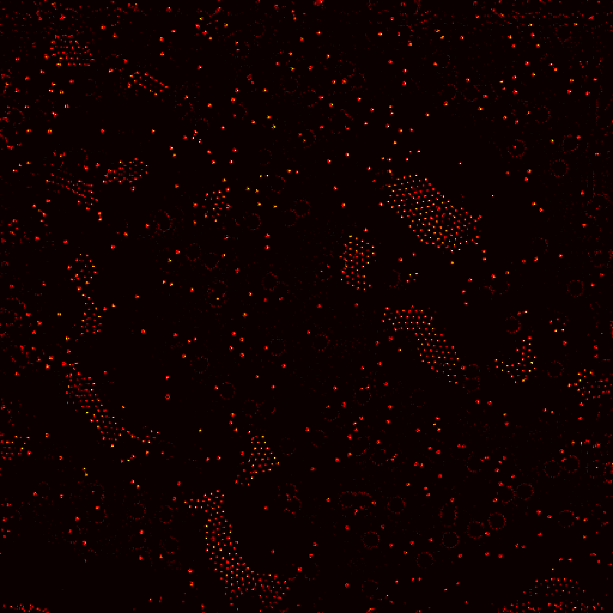
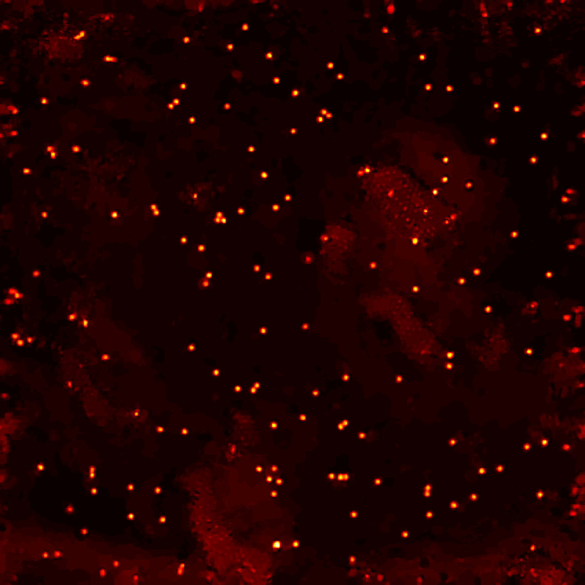

<h2 class="section-title"> Sectional hologram reconstruction through complex deconvolution," Optics and Lasers in Engineering </h2>
<h5 class="pubname"> Laser & Photonics Reviews, 2021 </h5>
<nav class="text-center" style="width: 100%">
  <a href="https://ni-chen.github.io/" class="author">Ni Chen1, &dagger;</a>
  <a href="https://www.eee.hku.hk/~elam/" class="author">Edmund Y. Lam2</a>
  <a href="https://www.ece.vt.edu/people/profile/poon" class="author"> T.-C. Poon 3</a>
  <a href="http://oeqelab.snu.ac.kr/PROF" class="author"> Byoungho Lee 1</a>
</nav>
<nav>
1 Seoul National University
  2 The University of Hong Kong
  3 Virginia Tech
</nav>

<section class="container">
<abstract>
<h5 class="section-title">  Abstract  </h5>
We propose a sectional hologram reconstruction method through complex deconvolution. By taking into account of both amplitude and phase (or real and imaginary parts) of wavefront propagation into the inverse problem model, we can perform more robust and better imaging quality in the sectional holographic reconstructions. The sectional capacity is about six times the diffraction-limited resolution, and the experimental results show that our method can achieve the best imaging quality compared to the state-of-the-art techniques.
  
</abstract>
</section>

<!-- Results -->
<section class="container">
<h5 class="section-title"> Some results  </h5>
<figure>
  
  
  <figcaption>
  Fig. 1: Reconstructions of an OSH of a two-layer beads object with conventional and  the proposed method. 
  </figcaption>
</figure>
</section>

<!-- Data -->

<!-- Downloads -->
<section class="container">
<h5 class="section-title">  Downloads </h5>

The manuscript link  | Github project link 

</section> 

<section class="container">
<h5 class="section-title"> Bibtex </h5>
<pre>
  @article{Chen2019OLE,
    title   = {Sectional hologram reconstruction through complex deconvolution},
    journal = {Optics and Lasers in Engineering},
    volume  = {127},
    pages   = {105945},
    year    = {2020},
    doi     = {10.1016/j.optlaseng.2019.105945},
    url     = {https://www.sciencedirect.com/science/article/pii/S014381661931084X?via%3Dihub},
    }
</pre>
</section>

